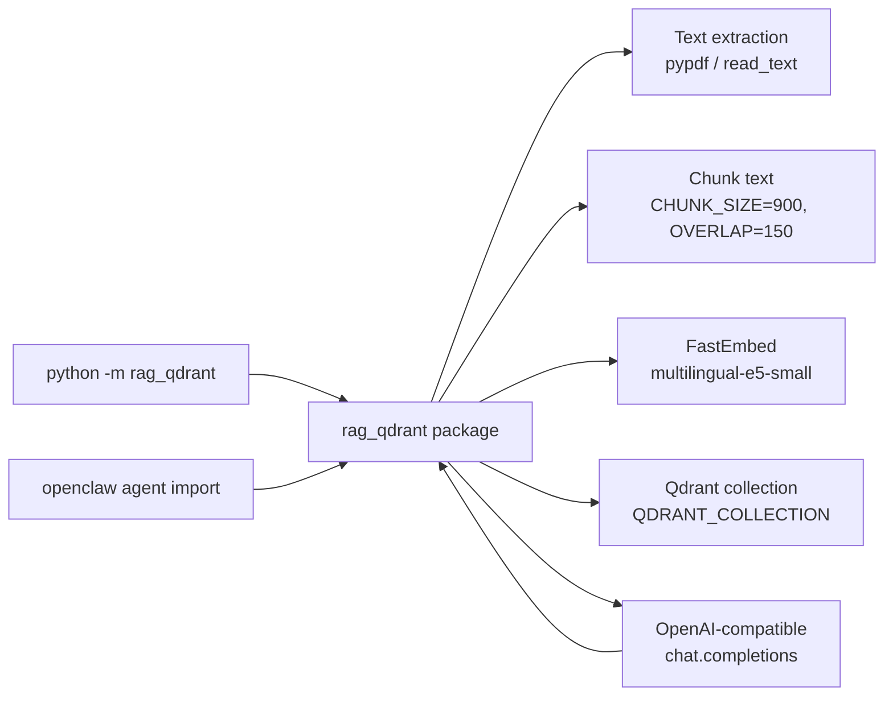

# rag-qdrant

A local, agent-callable RAG skill. Ingest text, PDF, or Markdown into a Qdrant collection with FastEmbed multilingual E5 embeddings and answer questions with a single OpenAI-compatible chat endpoint.

This skill is consumed three ways:

- **CLI** — `python -m rag_qdrant <subcommand>`
- **Python API** — `from rag_qdrant import RAG, ingest_text, ask, search, stats, ensure_collection`
- **Agent-mode message handler** — `from rag_qdrant import AgentMessage, Attachment, handle_message` (pure-library chat-style adapter; no transport dependency)

No Telegram bot, no extra UI, no provider-dispatch. The inference layer is one OpenAI-compatible chat completion endpoint.

## Quickstart

```bash
python -m venv .venv
. .venv/bin/activate
pip install -r requirements.txt
cp .env.example .env
# edit .env: set QDRANT_URL, QDRANT_API_KEY, INFERENCE_BASE_URL, INFERENCE_API_KEY, INFERENCE_MODEL
python -m rag_qdrant init
python -m rag_qdrant ingest-file /path/to/notes.pdf
python -m rag_qdrant ask "What does the document say about chunking?"
```

## Architecture



## CLI

| Subcommand | What it does |
|---|---|
| `init` | Create the Qdrant collection and payload indexes if missing |
| `stats` | Show points count, indexed vector count, collection status |
| `ingest-file <path> [--source NAME]` | Extract and ingest a PDF/TXT/MD file |
| `ingest-text <text> [--source NAME]` | Ingest a raw string |
| `search <question> [--top-k N]` | Raw vector search, returns the top-K contexts as JSON |
| `ask <question>` | Search + grounded answer through the inference model |
| `cache-stats` | Show entries, hits, misses, evictions for both caches |
| `cache-clear [--target {semantic\|search\|all}]` | Drop rows from one or both caches (default `all`) |
| `cache-info` | Show effective cache configuration (paths, TTLs, caps, threshold) |

All output is JSON to stdout. Logs go to `logs/rag-qdrant.log` and stderr.

## Python API

Flat functions:

```python
from rag_qdrant import (
    ensure_collection, ingest_text, ingest_file, ingest_photo,
    extract_photos,
    ask, search, stats, settings,
)
```

Thin `RAG` class (sugar over the flat functions, with an optional `Settings` override):

```python
from rag_qdrant import RAG
rag = RAG()
rag.ingest_text("The cat sat on the mat.", source="manual-note")
print(rag.ask("Where did the cat sit?")["answer"])
```

`RAG(...)` takes an optional `Settings` instance. The module-level `settings` is a frozen dataclass built from `.env` at import time.

### Agent-mode message handler

Pure-library adapter for chat-style transports (Telegram, webhooks, REPLs, openclaw agents). No transport deps — the agent layer converts inbound messages into an `AgentMessage` and sends the returned `AgentReply` back to the user. The configured inference model is the sole decision-maker; there are no command prefixes, no `/raw` escape hatches, and no override switches.

```python
from rag_qdrant import AgentMessage, AgentReply, Attachment, Photo, handle_message

# Text: LLM routes to store_text
handle_message(AgentMessage(text="The cat sat on the mat."))
# AgentReply(text='Ingested 1 chunks from auto-3b4f0e1a9c2d', photo_paths=())

# Text: LLM routes to ask_corpus
handle_message(AgentMessage(text="Where did the cat sit?"))
# AgentReply(text='The cat sat on the mat.', photo_paths=())  (no matched photos)

# Text: LLM replies with a clarification question
handle_message(AgentMessage(text="the cat thing"))
# AgentReply(text='Do you want me to save that, or search the corpus for cat notes?', photo_paths=())

# Attached file (auto-store, then LLM gets the notice + caption)
handle_message(
    AgentMessage(
        text="summarize this",
        attachments=(Attachment("notes.pdf", open("notes.pdf", "rb").read()),),
    )
)
# AgentReply(text='<grounded summary>', photo_paths=())
```

How routing works:

- Every inbound `AgentMessage` is sent to the inference model with a system prompt (see `rag_qdrant/prompts.py`) and two tools: `store_text(text, source="")` and `ask_corpus(question)`.
- LLM calls `store_text` → handler calls `ingest_text` with `source = "auto-<sha1(text[:40])[:12]>"` (or the explicit `source` the LLM passed); reply `Ingested N chunks from <source>`.
- LLM calls `ask_corpus` → handler calls `ask(question)`, returns **only** `result["answer"]` (no score, source, chunk_index, payload, or `contexts` list). Matched photo paths flow into `AgentReply.photo_paths`.
- LLM replies without a tool call (greeting, meta-question, clarification) → reply is the LLM's text, `photo_paths=()`.
- Attachments (`.pdf` / `.txt` / `.md` / `.text`) are ingested unconditionally **before** the LLM step; the LLM is told via a prepended notice that the file is already stored. The LLM cannot veto an attachment. An unsupported attachment suffix raises `ValueError`.
- Photos are saved to disk and their descriptions embedded (see [Photo support](#photo-support) below).
- The handler is **stateless**. The original message is dropped after classification; the next inbound message is classified fresh. If the LLM replies with a clarification question, that's the entire interaction — the user simply answers in a new turn.
- If the configured inference endpoint does not support tool calls, the handler returns a clear error string instead of raising. No `try/except` is needed in the calling code.

### Photo support

Photos uploaded with a description are stored on disk and embedded by description. A future query that matches the description automatically surfaces the photo on the agent's reply — no opt-in flag, no extra tool call, no LLM awareness of paths.

- **Storage**: `<RAG_PHOTOS_DIR>/<sha256(bytes)[:16]>.<ext>`. Default `RAG_PHOTOS_DIR=/root/rag-photos`. Directory is created on first write. Identical bytes dedupe on disk automatically.
- **Description required**: the user-supplied description is the only searchable signal and becomes the chunk text verbatim. Empty / whitespace descriptions raise `ValueError`. Supported extensions: `.jpg`, `.jpeg`, `.png`, `.webp`, `.gif`, `.bmp`, `.tiff`, `.heic`, `.heif`. Missing extension is accepted.
- **Unconditional ingest**: like attachments, the LLM cannot veto a photo. The handler saves the bytes and embeds the description before the LLM step.
- **`ask_corpus` propagation**: when the LLM calls `ask_corpus`, `rag_qdrant.ask` returns a `photos` list (deduped by `photo_path`, first-seen order). The handler copies those paths into `AgentReply.photo_paths` and the LLM never sees them.
- **Multiple photos in one message**: each is saved and ingested, each gets its own source (`photo-<sha12>`), each gets its own notice line.

```python
from rag_qdrant import AgentMessage, AgentReply, Photo, handle_message

with open("sunset.jpg", "rb") as f:
    reply: AgentReply = handle_message(AgentMessage(
        text="",
        photos=(Photo("sunset.jpg", f.read(), "a sunset over the bay"),),
    ))
# reply.text     == 'Ingested 1 chunk from photo-5c6fb3dfe09f (sunset.jpg)'
# reply.photo_paths == ('/root/rag-photos/5c6fb3dfe09f.jpg',)

with open("sunset.jpg", "rb") as f:
    reply = handle_message(AgentMessage(
        text="what does this look like?",
        photos=(Photo("sunset.jpg", f.read(), "a sunset over the bay"),),
    ))
# reply.text     == '<grounded answer from the LLM>'
# reply.photo_paths == ('/root/rag-photos/5c6fb3dfe09f.jpg',)  (or empty)
```

Programmatic use (no agent transport):

```python
from rag_qdrant import Photo, RAG

rag = RAG()
with open("sunset.jpg", "rb") as f:
    rag.ingest_photo(Photo("sunset.jpg", f.read(), "a sunset over the bay"))

result = rag.ask("Show me sunsets.")
# result["answer"] == '<grounded answer>'
# result["photos"] == [{'path': '/root/rag-photos/5c6fb3dfe09f.jpg', ...}]
```

## Environment

Required:

- `QDRANT_URL`, `QDRANT_API_KEY` — Qdrant instance (Cloud or self-hosted)
- `INFERENCE_BASE_URL`, `INFERENCE_API_KEY`, `INFERENCE_MODEL` — any OpenAI-compatible chat endpoint

Optional, with defaults:

- `QDRANT_COLLECTION` (default `system_rag`)
- `FASTEMBED_MODEL` (default `intfloat/multilingual-e5-small`)
- `EMBEDDING_DIM` (default `384`, must match the chosen model)
- `CHUNK_SIZE` (default `900`)
- `CHUNK_OVERLAP` (default `150`)
- `TOP_K` (default `6`)
- `MIN_RELEVANCE_SCORE` (default `0.78`) — contexts below this cosine similarity are dropped before the LLM call
- `INFERENCE_TEMPERATURE` (default `0.2`)
- `LOG_LEVEL`, `LOG_FILE`
- `RAG_PHOTOS_DIR` (default `/root/rag-photos`) — content-addressed photo storage directory; created on first write

Caching (opt-in, both disabled by default — see [Caching](#caching) below):

- `SEMANTIC_CACHE_ENABLED` (default `0`) — cache LLM answers keyed by question similarity
- `SEMANTIC_CACHE_PATH` (default `logs/semantic_cache.sqlite`)
- `SEMANTIC_CACHE_TTL_SECONDS` (default `86400`) — TTL for hit answers
- `SEMANTIC_CACHE_MISS_TTL_SECONDS` (default `3600`) — shorter TTL for "No relevant information found"
- `SEMANTIC_CACHE_MAX_ENTRIES` (default `1000`)
- `SEMANTIC_CACHE_SIMILARITY_THRESHOLD` (default `0.88`) — cosine threshold for a hit
- `SEMANTIC_CACHE_CACHE_MISSES` (default `1`) — set to `0` to skip caching miss answers
- `SEARCH_CACHE_ENABLED` (default `0`) — cache raw Qdrant search results keyed by exact question hash
- `SEARCH_CACHE_PATH` (default `logs/search_cache.sqlite`)
- `SEARCH_CACHE_TTL_SECONDS` (default `86400`)
- `SEARCH_CACHE_MAX_ENTRIES` (default `5000`)

See `references/setup.md` for full details, including Qdrant Cloud and local Qdrant instructions, FastEmbed model selection notes, and OpenAI-compatible endpoint configuration.

## Examples

- `examples/ingest_cli.md` — worked CLI examples
- `examples/agent_usage.md` — how an openclaw agent imports and calls the skill, including the agent-mode message handler pattern

## Caching

Two opt-in caches, both backed by SQLite files in `logs/` by default and disabled until you flip the corresponding `*_ENABLED=1` env var. Storage uses the stdlib `sqlite3`; no new dependencies. When disabled, the wrappers short-circuit to a single boolean check and never touch SQLite.

### Semantic cache (LLM answers, keyed by question similarity)

When `SEMANTIC_CACHE_ENABLED=1`, `ask()` first embeds the question and scans the semantic cache for any stored question with cosine similarity above `SEMANTIC_CACHE_SIMILARITY_THRESHOLD` (default `0.88`). A hit returns the stored answer and contexts directly, skipping both the Qdrant search and the LLM call. A miss runs the normal pipeline and stores the result.

- **Hits / misses** log at INFO / DEBUG respectively.
- **TTL** for hit answers defaults to 24h. `"No relevant information found"` answers use a separate, shorter TTL (`SEMANTIC_CACHE_MISS_TTL_SECONDS`, default 1h) so an empty corpus doesn't pin a stale miss forever. Set `SEMANTIC_CACHE_CACHE_MISSES=0` to skip caching miss answers entirely.
- **Cap** is `SEMANTIC_CACHE_MAX_ENTRIES` (default 1000). Lazy LRU eviction drops the oldest `max_entries // 10` rows on each insert above the cap. Cheap because the lookup is a pure-Python scan (no separate vector index).
- **Ingest does not invalidate the semantic cache** by design. Cached answers may become slightly stale after new content is added; the next miss-after-TTL picks up the new content. Trade-off: clearing on every ingest would defeat the cache in any non-static corpus.

### Search cache (Qdrant contexts, keyed by exact question hash)

When `SEARCH_CACHE_ENABLED=1`, `search()` checks an in-process LRU (64 entries, hard-coded) and then an on-disk SQLite file keyed by `sha256(collection|fastembed_model|top_k|normalized_question)`. A hit returns the stored contexts without hitting Qdrant. A miss runs the normal `query_points`/`search` call and stores the result.

- **Invalidation**: every successful `ingest_text` / `ingest_file` wipes the search cache (and clears the in-process LRU). The stored contexts are no longer authoritative.
- **TTL** defaults to 24h. Cap defaults to 5000 rows.

### Programmatic access

```python
from rag_qdrant import (
    semantic_cache_stats, semantic_cache_clear,
    search_cache_stats, search_cache_clear,
)

print(semantic_cache_stats())  # {'enabled': True, 'entries': 12, 'hits': 47, ...}
semantic_cache_clear()        # returns rows deleted
```

`RAG` exposes the same four methods: `rag.semantic_cache_stats()`, `rag.semantic_cache_clear()`, `rag.search_cache_stats()`, `rag.search_cache_clear()`.

### CLI

```bash
python -m rag_qdrant cache-info          # show effective config
python -m rag_qdrant cache-stats         # entries / hits / misses / evictions
python -m rag_qdrant cache-clear         # default: clear both
python -m rag_qdrant cache-clear --target semantic
python -m rag_qdrant cache-clear --target search
```

### Concurrency and failure modes

All cache wrappers catch `sqlite3.OperationalError` (locked DB, disk full, etc.) and fall through to the non-cached path with a warning log. The cache never raises.

## Logging

All major operations log to `logs/rag-qdrant.log` and stderr with a single shared formatter: model load, chunking, embedding, Qdrant collection creation / upsert / search, prompt inference, and errors. The logger is `skill_rag_qdrant`, configured once at import.

## Layout

```
rag_qdrant/
  __init__.py        # public API (RAG, flat functions, settings, agent handler, __version__)
  __main__.py        # CLI: init, stats, ingest-file, ingest-text, search, ask, cache-*
  config.py          # Settings dataclass, .env loading
  qdrant_store.py    # collection, indexes, ingest_text, ingest_file, search
  text_processing.py # extract_text (pdf/txt/md), chunk_text, normalize_text
  inference.py       # ask() / answer_question() — search + LLM
  cache.py           # SemanticCache + SearchCache (opt-in, SQLite-backed)
  agent_handler.py   # AgentMessage, AgentReply, Attachment, Photo, handle_message (LLM-routed chat-style adapter)
  photo_store.py     # Photo dataclass + save_photo (content-addressed disk dedupe)
  photo_matching.py  # extract_photos(contexts) for ask_corpus photo propagation
  prompts.py         # SYSTEM_PROMPT + tool schemas for the LLM-routed flow
  logging_setup.py   # file + stream handler, rotating log file
references/
  setup.md
examples/
  ingest_cli.md
  agent_usage.md
tests/
  run_tests.py            # self-contained, no pytest
  test_agent_handler.py   # behavioral tests for the LLM-routed handler + photos + classify_and_route
SKILL.md                  # openclaw skill frontmatter
README.md                 # this file
```

## Tests

```bash
python3 tests/run_tests.py
```

The test suite is self-contained (no pytest). It covers config field shape, `chunk_text`, `extract_text`, `qdrant_store` shape, the `inference` module shape, the cache layer (round-trip, TTL expiry, max-entries eviction, miss flag, ingest invalidation, inference-bypass-when-disabled, inference-cache-hit-when-enabled), the agent-mode message handler (`AgentMessage` / `Attachment` / `handle_message`) plus the `classify_and_route` wrapper via behavioral checks, and a repo-wide grep that asserts no OpenRouter / Telegram stragglers remain.
