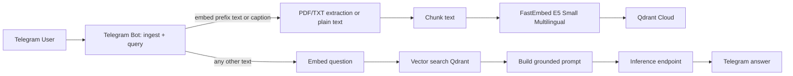

# skill-rag-qdrant

Python system RAG skill with a single Telegram bot and Qdrant Cloud.

## Architecture



## Setup

```bash
cd /home/workspace/Skills/skill-rag-qdrant
python -m venv .venv
. .venv/bin/activate
pip install -r requirements.txt
cp .env.example .env
```

Fill `.env`. Secrets must stay in `.env`; it is git-ignored.

`TELEGRAM_OWNER_ID` (recommended): if set, this Telegram user ID is the authoritative bot owner on every start. It overrides any `owner_id` already in `data/telegram_access.json` and disables the first-claim fallback. Treat `0` or empty as unset.

`TELEGRAM_SEED_ALLOWLIST` is optional and is consumed only once: on first run, when `data/telegram_access.json` does not exist yet. After that, edit the JSON file or use the bot's `/allow` and `/disallow` commands.

## Commands

```bash
python -m scripts.rag_qdrant init
python -m scripts.rag_qdrant ingest-file /path/to/file.pdf
python -m scripts.rag_qdrant ingest-text "Text to index" --source manual
python -m scripts.rag_qdrant search "question"
python -m scripts.rag_qdrant ask "question"
python -m scripts.rag_qdrant stats
python -m scripts.rag_qdrant run-bot
```

## Telegram flow

The bot handles both ingestion and querying in a single conversation:

- Prefix any text with `embed ` (case-insensitive) to store it in Qdrant. Example: `embed The cat sat on the mat.`
- Send a PDF, TXT, or MD document with the caption `embed <optional note>` to store its content.
- Send any other text to ask a question. The bot searches Qdrant, builds a grounded prompt, calls the configured inference endpoint, and replies with an answer.

## Bot commands

| Command | Who | What it does |
|---|---|---|
| `/start` | anyone | Welcome message. |
| `/help` | anyone | List all commands and usage. |
| `/whoami` | anyone | Show your Telegram numeric user ID and your role (owner / allowed / unauthorized). |
| `/allow <user_id>` | owner only | Add a user ID to the embed allowlist. |
| `/disallow <user_id>` | owner only | Remove a user ID from the embed allowlist. The owner cannot disallow themselves. |
| `/allowlist` | owner only | Show the current owner and the allowlist. |

## Access control

- **Owner (env-authoritative):** if `TELEGRAM_OWNER_ID` is set in `.env`, that user is the owner on every bot start. The env var overrides any owner already in `data/telegram_access.json` and disables the first-claim fallback.
- **Owner (first-claim fallback):** if `TELEGRAM_OWNER_ID` is unset and no owner exists in the JSON file, the first Telegram user to ever send a message to the bot is auto-promoted to owner. This is a one-time event. The owner is told on their first reply: "You are now the owner of this bot."
- **Allowlist:** the owner manages a list of additional Telegram user IDs that are allowed to embed.
- **Queries:** open to everyone, no gate.
- **Embeds:** only the owner and allowlisted users can run an `embed ` command.
- **Persistence:** owner ID and allowlist are stored in `data/telegram_access.json` and survive bot restarts. Writes are atomic (`os.replace` of a temp file). Concurrent updates are serialized with an `asyncio.Lock` inside the bot process.
- **Seeding:** `TELEGRAM_SEED_ALLOWLIST` is read once, on first run, to bootstrap the allowlist before any message is received. The first user to message the bot afterwards still becomes the owner (unless `TELEGRAM_OWNER_ID` overrides it).

## Inference

A single OpenAI-compatible chat completion endpoint. Configure it in `.env`:

```env
INFERENCE_BASE_URL=https://your-endpoint/v1
INFERENCE_API_KEY=...
INFERENCE_MODEL=your-model
INFERENCE_TEMPERATURE=0.2
```

The bot uses `openai` Python client pointed at `INFERENCE_BASE_URL` to call `chat.completions.create` with `INFERENCE_MODEL` and `INFERENCE_TEMPERATURE`. No provider dispatch, no OpenRouter-only fields.

## Logs

All major steps log to `logs/rag-qdrant.log`: Telegram receipt, owner set / claim, allowlist mutation, extraction, chunking, embedding, Qdrant collection creation/upsert/search, prompt inference, and errors.


[](https://www.youtube.com/watch?v=ib9c2kH0_Pk)

[](https://www.youtube.com/watch?v=arghqsaLy8Q)
