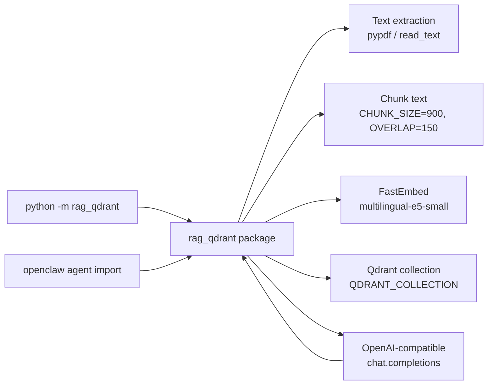

# rag-qdrant

A local, agent-callable RAG skill. Ingest text, PDF, or Markdown into a Qdrant collection with FastEmbed multilingual E5 embeddings and answer questions with a single OpenAI-compatible chat endpoint.

This skill is consumed three ways:

- **CLI** — `python -m rag_qdrant <subcommand>`
- **Python API** — `from rag_qdrant import RAG, ingest_text, ask, search, stats, ensure_collection`
- **Agent-mode message handler** — `from rag_qdrant import AgentMessage, Attachment, handle_message` (pure-library chat-style adapter; no transport dependency)

No Telegram bot, no extra UI, no provider-dispatch. The inference layer is one OpenAI-compatible chat completion endpoint.

## Quickstart

```bash
python -m venv .venv
. .venv/bin/activate
pip install -r requirements.txt
cp .env.example .env
# edit .env: set QDRANT_URL, QDRANT_API_KEY, INFERENCE_BASE_URL, INFERENCE_API_KEY, INFERENCE_MODEL
python -m rag_qdrant init
python -m rag_qdrant ingest-file /path/to/notes.pdf
python -m rag_qdrant ask "What does the document say about chunking?"
```

## Architecture



## CLI

| Subcommand | What it does |
|---|---|
| `init` | Create the Qdrant collection and payload indexes if missing |
| `stats` | Show points count, indexed vector count, collection status |
| `ingest-file <path> [--source NAME]` | Extract and ingest a PDF/TXT/MD file |
| `ingest-text <text> [--source NAME]` | Ingest a raw string |
| `search <question> [--top-k N]` | Raw vector search, returns the top-K contexts as JSON |
| `ask <question>` | Search + grounded answer through the inference model |

All output is JSON to stdout. Logs go to `logs/rag-qdrant.log` and stderr.

## Python API

Flat functions:

```python
from rag_qdrant import (
    ensure_collection, ingest_text, ingest_file,
    ask, search, stats, settings,
)
```

Thin `RAG` class (sugar over the flat functions, with an optional `Settings` override):

```python
from rag_qdrant import RAG
rag = RAG()
rag.ingest_text("The cat sat on the mat.", source="manual-note")
print(rag.ask("Where did the cat sit?")["answer"])
```

`RAG(...)` takes an optional `Settings` instance. The module-level `settings` is a frozen dataclass built from `.env` at import time.

### Agent-mode message handler

Pure-library adapter for chat-style transports (Telegram, webhooks, REPLs, openclaw agents). No transport deps — the agent layer converts inbound messages into an `AgentMessage` and sends the returned string back to the user.

```python
from rag_qdrant import AgentMessage, Attachment, handle_message

# Embed text
handle_message(AgentMessage(text="Embed hello world"))
# 'Ingested 1 chunks from telegram-3b4f0e1a9c2d'

# Embed attached file
handle_message(
    AgentMessage(
        text="Embed",
        attachment=Attachment("notes.pdf", open("notes.pdf", "rb").read()),
    )
)
# 'Ingested 14 chunks from notes.pdf'

# Query
handle_message(AgentMessage(text="Query where is the cat?"))
# ONLY the answer string, e.g. 'The cat sat on the mat.'
```

Rules (case-insensitive prefix match):

- `Embed <text>` → `ingest_text` with `source = "telegram-<sha1(text[:40])[:12]>"`; ack `Ingested N chunks from <source>`. Empty text falls back to `sha1(utc_iso_timestamp)[:12]` for the source.
- `Embed` + PDF/TXT/MD/TEXT attachment → temp file + `ingest_file(path, source=<filename>)`; same ack format.
- `Query <question>` → `ask(question)`, return **only** `result["answer"]` (no score, source, chunk_index, payload, or `contexts` list).
- `Embed` with no text and no attachment, `Query` with no body, or any non-`Embed`/`Query` text raises `ValueError`. The handler does not produce a graceful reply for those cases.

## Environment

Required:

- `QDRANT_URL`, `QDRANT_API_KEY` — Qdrant instance (Cloud or self-hosted)
- `INFERENCE_BASE_URL`, `INFERENCE_API_KEY`, `INFERENCE_MODEL` — any OpenAI-compatible chat endpoint

Optional, with defaults:

- `QDRANT_COLLECTION` (default `system_rag`)
- `FASTEMBED_MODEL` (default `intfloat/multilingual-e5-small`)
- `EMBEDDING_DIM` (default `384`, must match the chosen model)
- `CHUNK_SIZE` (default `900`)
- `CHUNK_OVERLAP` (default `150`)
- `TOP_K` (default `6`)
- `MIN_RELEVANCE_SCORE` (default `0.78`) — contexts below this cosine similarity are dropped before the LLM call
- `INFERENCE_TEMPERATURE` (default `0.2`)
- `LOG_LEVEL`, `LOG_FILE`

See `references/setup.md` for full details, including Qdrant Cloud and local Qdrant instructions, FastEmbed model selection notes, and OpenAI-compatible endpoint configuration.

## Examples

- `examples/ingest_cli.md` — worked CLI examples
- `examples/agent_usage.md` — how an openclaw agent imports and calls the skill, including the agent-mode message handler pattern

## Logging

All major operations log to `logs/rag-qdrant.log` and stderr with a single shared formatter: model load, chunking, embedding, Qdrant collection creation / upsert / search, prompt inference, and errors. The logger is `skill_rag_qdrant`, configured once at import.

## Layout

```
rag_qdrant/
  __init__.py        # public API (RAG, flat functions, settings, agent handler, __version__)
  __main__.py        # CLI: init, stats, ingest-file, ingest-text, search, ask
  config.py          # Settings dataclass, .env loading
  qdrant_store.py    # collection, indexes, ingest_text, ingest_file, search
  text_processing.py # extract_text (pdf/txt/md), chunk_text, normalize_text
  inference.py       # ask() / answer_question() — search + LLM
  agent_handler.py   # AgentMessage, Attachment, handle_message (chat-style adapter)
  logging_setup.py   # file + stream handler, rotating log file
references/
  setup.md
examples/
  ingest_cli.md
  agent_usage.md
tests/
  run_tests.py            # self-contained, no pytest
  test_agent_handler.py  # source-grep + behavioral checks for the four handler rules
SKILL.md                  # openclaw skill frontmatter
README.md                 # this file
```

## Tests

```bash
python3 tests/run_tests.py
```

The test suite is self-contained (no pytest). It covers config field shape, `chunk_text`, `extract_text`, `qdrant_store` shape, the `inference` module shape, the agent-mode message handler (`AgentMessage` / `Attachment` / `handle_message`) via source-grep + behavioral checks, and a repo-wide grep that asserts no OpenRouter / Telegram stragglers remain.
