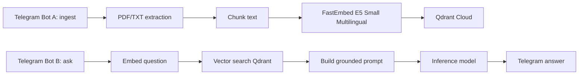

# skill-rag-qdrant

Python system RAG skill with two Telegram bots and Qdrant Cloud.

[](https://www.youtube.com/watch?v=ib9c2kH0_Pk)

## Architecture



## Setup

```bash
cd /home/workspace/Skills/skill-rag-qdrant
python -m venv .venv
. .venv/bin/activate
pip install -r requirements.txt
cp .env.example .env
```

Fill `.env`. Secrets must stay in `.env`; it is git-ignored.

## Commands

```bash
python -m scripts.rag_qdrant init
python -m scripts.rag_qdrant ingest-file /path/to/file.pdf
python -m scripts.rag_qdrant ingest-text "Text to index" --source manual
python -m scripts.rag_qdrant search "question"
python -m scripts.rag_qdrant ask "question"
python -m scripts.rag_qdrant run-ingest-bot
python -m scripts.rag_qdrant run-query-bot
python -m scripts.rag_qdrant run-all
```

## Telegram flow

- Bot A receives PDFs, TXT/MD files, or plain text and stores chunks in Qdrant.
- Bot B receives questions, searches Qdrant, calls the configured inference provider, and replies with answer + sources.

## Inference providers

Default provider is OpenRouter pinned to Cloudflare with fallback disabled:

```env
INFERENCE_PROVIDER=openrouter
OPENROUTER_URL=https://openrouter.ai/api/v1/chat/completions
OPENROUTER_AK=...
OPENROUTER_MODEL=z-ai/glm-4.7-flash
OPENROUTER_PROVIDER=cloudflare
INFERENCE_TEMPERATURE=0.2
```

`OPENROUTER_PROVIDER=cloudflare` sends `provider.order=["cloudflare"]` and `allow_fallbacks=false`.

Legacy `zo_ask` and generic `openai_compatible` providers are still available by changing `INFERENCE_PROVIDER` and filling the matching `INFERENCE_*` settings.

## Logs

All major steps log to `logs/rag-qdrant.log`: Telegram receipt, extraction, chunking, embedding, Qdrant collection creation/upsert/search, prompt inference, and errors.
